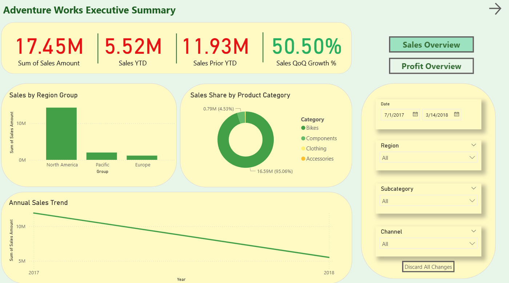
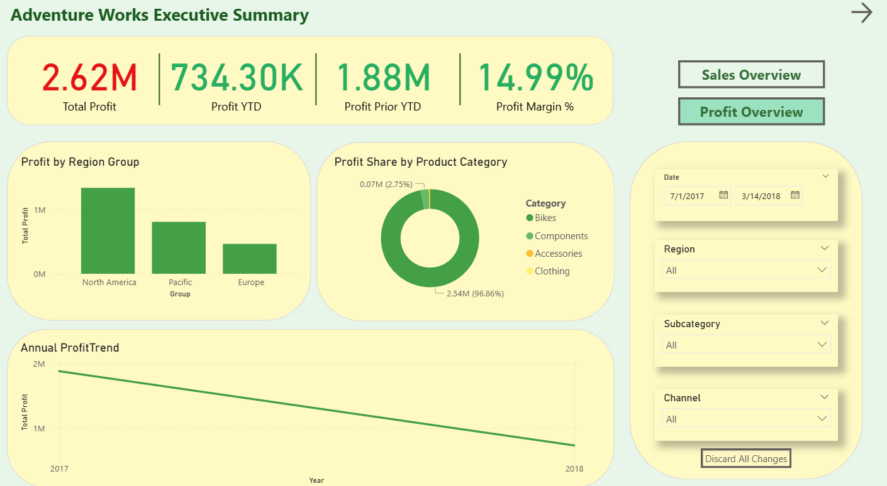

# AdventureWorks Sales Performance Report

An end-to-end Power BI project analyzing global sales data to track revenue growth, profit margins, and product performance for a manufacturing company.

## Project Overview
This dashboard transforms raw sales and customer data into a strategic tool for executive leadership. It provides a high-level summary of financial health while allowing for granular analysis of specific product categories and customer demographics.

## Dataset
The analysis is based on a relational database consisting of several tables:
* **Sales & Orders:** Transactional records, revenue, and product costs.
* **Products:** Hierarchy of categories and subcategories.
* **Customers:** Demographic profiles including income and occupation.
* **Geography:** Global sales regions and territories.
* **Calendar:** Date table for time-intelligence and trend analysis.

## Tools Used
* **Power BI:** Data modeling and interactive visualization.
* **Power Query:** Data cleaning, ETL processing, and table relationships.
* **DAX:** Implementation of complex measures for profit calculation, revenue goals, and return rates.

## Key Insights
* **Financial Tracking:** Real-time monitoring of revenue and profit against set business targets.
* **Profitability Analysis:** Identification of high-margin product categories versus high-volume items.
* **Customer Behavior:** Segmentation of purchase frequency based on customer occupation and income levels.
* **Product Performance:** Comparison between revenue-driving products (Bikes) and high-volume accessories (Tires and Helmets).
* **Return Trends:** Monitoring product return rates to identify quality control or shipping issues.

## Dashboard Preview
### 1. Executive Summary

### 2. Product Detail Analysis

## Business Value
This report provides executives with a "single source of truth" for business performance. By comparing total company profit against specific category performance, leadership can optimize inventory levels and marketing spend toward the most profitable segments and regions.
